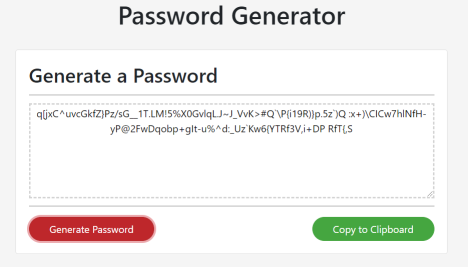

# password-generator
A javascript-based password generator.

# Purpose
Creates variable length randomly generated passwords using specified character sets.  
Password can be easily copied to the clipboard for easy pasting.

# Directions
1. Click Generate to begin option selection
2. Specify the length of the password desired (8-128 characters)
3. Select the Types of characters that can be included
4. A random passsword will be generated based on the options selected
5. Click 'Generate' again to generate a new random password
6. Click 'Copy to Clipboard' to save the last generated password to the clipboard.

# Options
* Variable Length (8-128 characters)
* Use Special Characters (!@#$%^...)
* Use Numbers (0-9)
* Use UpperCase Characters (A-Z)
* Use LowerCase Characters (a-z)

# Screenshot

# Try It At
[Github Pages - Password Generator](https://kgeary.github.io/password-generator/)